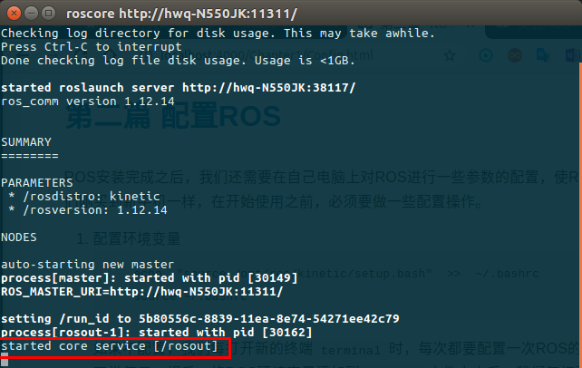
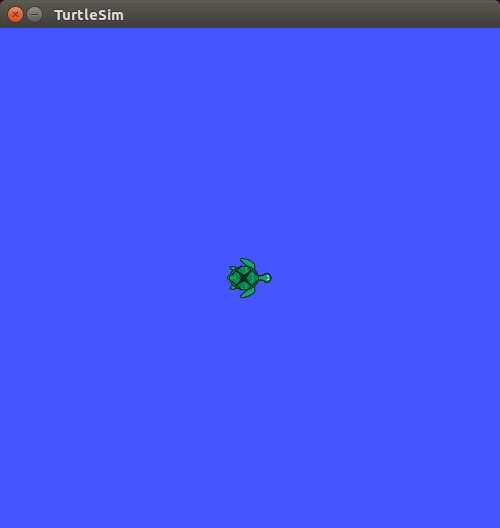
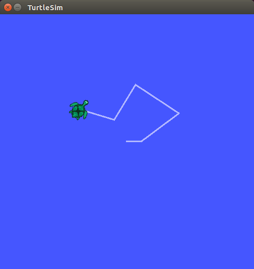

# 第二篇 ROS配置
ROS安装完成之后，我们还需要在自己电脑上对ROS进行一些参数的配置，使ROS能够正常工作。就像我们刚买到新手机一样，在开始使用之前，必须要做一些配置操作。

1.  配置环境变量
```bash
echo  "source /opt/ros/kinetic/setup.bash"  >>  ~/.bashrc
source ~/.bashrc
```
如果不配置，我们每打开新的终端**`terminal`**时，每次都要配置一次ROS的环境，不然ROS的命令不能正常使用。相反，将ROS环境变量添加到**`～/.bashrc`**文件中之后，我们每打开新的终端**`terminal`**时，系统每次都会自动把ROS环境变量配置好，ROS的命令就可以直接使用，很方便。
2. 到目前为止，我们已经安装了运行核心ROS软件包所需的软件。为了创建和管理自己的ROS工作空间，我们还需要安装**`rosinstall`**工具，以及其依赖包：
```bash
sudo apt install python-rosdep python-rosinstall python-rosinstall-generator python-wstool build-essential
```
rosinstall是ROS中一个独立的命令行工具包。通过一条命令就可以下载ROS的许多源代码。
3. 初始化 **`rosdep`** 
```bash
sudo rosdep init
```
在使用ROS支持的工具或命令之前，需要初始化ROS。**`rosdep init`**会自动初始化ROS，并安装ROS运行必需的依赖文件。
4. 更新 **`update`**
```bash
rosdep update
```
紧跟着就 **`update`**，更新此版本的ROS到最新的状态。**并且不用`sudo`切换到管理员权限**
5. 至此，我们就完成了ROS的安装和配置工作，接下来就测试一下ROS能否正常工作吧。
- 首先启动ROS，运行 **`roscore`**
  ```bash
  roscore
  ```
  终端输出结果如图，就说明ROS能正常 **启动**：
  
- 然后运行ROS的吉祥物-小海龟，测试ROS的**运行**是否正常
重新打开一个新的终端，输入：
    ```bash
    rosrun turtlesim turtlesim_node
    ```
    你就可以看到弹出一个新的窗口界面，一只小海龟出现在窗口里
　　　　　　

  怎么操控这个小海龟呢？  
  我们再重新打开一个终端，启动按键控制程序，输入命令：
  ```bash
  rosrun turtlesim turtle_teleop_key
  ```
  接下来，我们运行在这个终端里，并通过键盘上的方向键，就可以控制小海龟的运动了。
    

至此，经过了上面的测试，ROS的安装、配置工作就已经全部完成了。

下面就可以正式开启ROS的学习之旅～～～