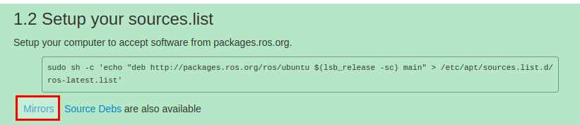
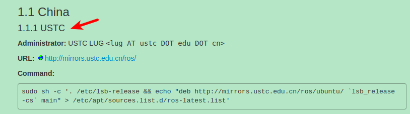

# 第一篇   ROS 安装

1. 在安装之前，先要配置好Ubuntu的系统环境
打开`System Settings` -> `Software & updates` -> `ubuntu software`，全部都勾选,如图所示:

2. 更改源为中国科学技术大学的镜像源  (使用国内的Ubuntu镜像源下载速度会更快些)，如图所示:

3. 添加 sources.list(添加镜像源：科大源)
```
sudo sh -c '. /etc/lsb-release && echo "deb http://mirrors.ustc.edu.cn/ros/ubuntu/ `lsb_release -cs` main" > /etc/apt/sources.list.d/ros-latest.list'
```
 * ⑴. 点击下图红框中的链接，进入： 

 * ⑵. 粘贴下图的命令Command即可。

4. 添加Keys(公钥是Ubuntu的一种安全机制，也是ROS安装不可缺少的一步，第`1`步勾选的目的就是这个)
```
sudo apt-key adv --keyserver 'hkp://keyserver.ubuntu.com:80' --recv-key C1CF6E31E6BADE8868B172B4F42ED6FBAB17C654
```
5. 执行系统更新，更新源列表,  **确保获得的ROS软件是最新的**
```
sudo apt update 
sudo apt upgrade 
```
6. 安装ROS包
ROS中有很多函数库和工具，官网提供了四种默认的安装方式，当然也可以单独安装某个特定的软件包。这四种方式包括**桌面完整版安装、桌面版安装，基础版安装、单独软件包安装**。推荐安装桌面完整版安装（包含ROS、rqt、rviz、通用机器人函数库、2D/3D仿真器、导航以及2D/3D感知功能），如下：
* 安装Kinetic版本的ROS(**desktop-full : 桌面完整版**)
  ```
  sudo apt-get install ros-kinetic-desktop-full 
  ```
如果你不想安装**桌面完整版**，你还可以尝试以下三种方式安装：
- **桌面版安装**（包含ROS、rqt、rviz以及通用机器人函数库）
  ```
  sudo apt-get install ros-kinetic-desktop
  ```
- **基础版安装**（包含ROS核心软件包、构建工具以及通信相关的程序库，无GUI工具）
  ```
  sudo apt-get install ros-kinetic-ros-base
  ```
- **单独软件包安装**（这种安装方式在运行ROS缺少某些package依赖时会经常用到。你可以安装某个指定的ROS软件包,使用软件包名称替换掉下面的PACKAGE）
  ``` 
  sudo apt-get install ros-kinetic-PACKAGE 
  ```
    例如系统提示找不到slam-gmapping，你就可以：
  ```
  sudo apt-get install ros-kinetic-slam-gmapping
  ```
  要查找可用的软件包，请运行：
  ```
  apt-cache search ros-kinetic
  ```

