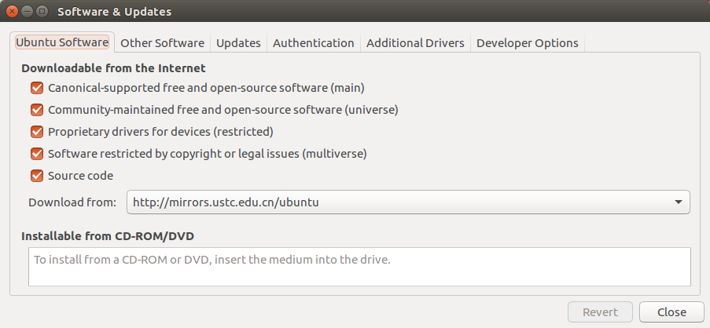
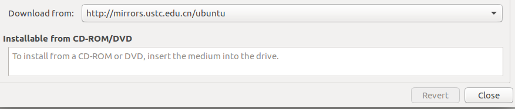

# 第一章   ROS 安装

1. 在安装之前，先要配置好Ubuntu的系统环境
打开`System Settings` -> `Software & updates` -> `ubuntu software`，全部都勾选,如图所示:

2. 更改源为中国科学技术大学的镜像源  (使用国内的Ubuntu镜像源下载速度会更快些)，如图所示:

3. 添加 sources.list
```
sudo sh -c '. /etc/lsb-release && echo "deb http://mirrors.ustc.edu.cn/ros/ubuntu/ `lsb_release -cs` main" > /etc/apt/sources.list.d/ros-latest.list'
```

4. 