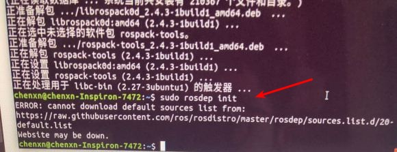

# Chpaer 1 小结
在第一章的学习过程中，我们主要是完成了ROS的安装工作，工欲善其事，必先利其器。  
在学习的过程中，也是遇到了一些问题，对于还没入门的我来说，有的问题反复出现，解决的时间也很长。在此记录下来，以备日后查看。  
<font color="red">第一章遇到的问题大都跟网络有关系，挂vpn可能会解决问题</font>

## 1. 执行命令 **`sudo rosdep init`**出错  
 * 问题如图所示：　  
　　　   
 * **解决方法：**  
 这个问题的原因是*raw.githubusercontent.com*域名解释被污染了（你懂的...）。  
 解决方法是到[ipaddress.com](https://www.ipaddress.com/)上查询*raw.githubusercontent.com*的ip地址，然后在ubuntu的/etc/hosts文件上面加入这条域名解释就行了
```bash
sudo vim /etc/hosts
```
*<font color="red">**注：查询到的IP地址不一定是下图所示**</font>*
　　  

## 2. 执行命令 **`rosdep update`**出错
 * **问题如图所示：**  
 　　　 
 * **解决方法：**   
 主要是网络访问不稳定，只有多来几次。或者换成手机热点多试几次。