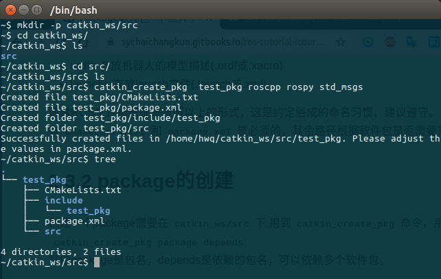
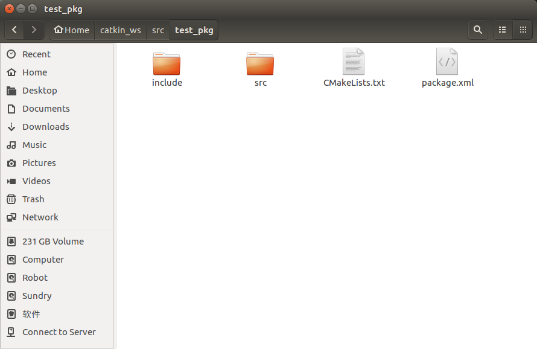

# package包
在前面第二篇分别介绍了二进制包和源代码包。ROS中对package的定义更加具体，<font color="red">**它不仅是Linux上的软件包，更是catkin编译的基本单元，我们调用catkin_make编译的对象就是一个个ROS的package**</font>，也就是说任何ROS程序只有组织成package才能编译。所以package也是ROS源代码存放的地方，任何ROS的代码无论是C++还是Python都要放到package中，这样才能正常的编译和运行。  
一个package可以编译出来多个目标文件（ROS可执行程序、动态静态库、头文件等等）。

## 一、package结构
一个package下常见的文件、路径有：
```
├── CMakeLists.txt    #package的编译规则(必须)
├── package.xml       #package的描述信息(必须)
├── src/              #源代码文件
├── include/          #C++头文件
├── scripts/          #可执行脚本
├── msg/              #自定义消息
├── srv/              #自定义服务
├── models/           #3D模型文件
├── urdf/             #urdf文件
├── launch/           #launch文件
```

其中定义package的是CMakeLists.txt和package.xml，这两个文件是package中必不可少的。catkin编译系统在编译前，首先就要解析这两个文件。这两个文件就定义了一个package。
 * CMakeLists.txt: 定义package的包名、依赖、源文件、目标文件等编译规则，是package不可少的成分
 * package.xml: 描述package的包名、版本号、作者、依赖等信息，是package不可少的成分
 * src/: 存放ROS的源代码，包括C++的源码和(.cpp)以及Python的module(.py)
 * include/: 存放C++源码对应的头文件
 * scripts/: 存放可执行脚本，例如shell脚本(.sh)、Python脚本(.py)
 * msg/: 存放自定义格式的消息(.msg)
 * srv/: 存放自定义格式的服务(.srv)
 * models/: 存放机器人或仿真场景的3D模型(.sda, .stl, .dae等)
 * urdf/: 存放机器人的模型描述(.urdf或.xacro)
 * launch/: 存放launch文件(.launch或 .xml)

通常ROS文件组织都是按照以上的形式，这是约定俗成的命名习惯，建议遵守。以上路径中，只有CMakeLists.txt和package.xml是必须的，其余路径根据软件包是否需要来决定。

## 二、package的创建

创建一个package需要在catkin_ws/src下,用到 **`catkin_create_pkg`**命令，用法是：
```
catkin_create_pkg package depends
```
其中package是包名，depends是依赖的包名，可以依赖多个软件包。  
例如，新建一个package叫做test_pkg,依赖roscpp、rospy、std_msgs(这些都是常用依赖)。
```
catkin_create_pkg test_pkg roscpp rospy std_msgs
```
这样就会在当前路径下新建test_pkg软件包，包括：
```
├── CMakeLists.txt
├── include
│   └── test_pkg
├── package.xml
└── src
```
如图所示：  

  
**`catkin_create_pkg`**帮你完成了软件包的初始化，填充好了CMakeLists.txt和package.xml，并且将依赖项填进了这两个文件中。

## 三、package相关命令
### 1. rospack
rospack是对package管理的工具，命令的用法如下：

rostopic命令|作用
:---:|:---:
rospack help	|显示rospack的用法
rospack list	|列出本机所有package
rospack depends [package]|	显示package的依赖包
rospack find [package]	|定位某个package
rospack profile	|刷新所有package的位置记录
*<font color="red">**注**</font>：以上命令如果package缺省，则默认为当前目录(如果当前目录包含package.xml)*

### 2. roscd
*roscd* 命令类似与Linux系统的 *cd* ，改进之处在于roscd可以直接cd到ROS的软件包。

rostopic命令|作用
:---:|:---:
roscd [pacakge]	|cd到ROS package所在路径

### 3. rosls
rosls也可以视为Linux指令ls的改进版，可以直接lsROS软件包的内容。

rosls命令	|作用
:---:|:---:
rosls [pacakge]|	列出pacakge下的文件

### 4. rosdep
rosdep是用于管理ROS package依赖项的命令行工具，用法如下：

rosdep命令|	作用
:---:|:---:
rosdep check [pacakge]	|检查package的依赖是否满足
rosdep install [pacakge]	|安装pacakge的依赖
rosdep db	|生成和显示依赖数据库
rosdep init	|初始化/etc/ros/rosdep中的源
rosdep keys	|检查package的依赖是否满足
rosdep update|	更新本地的rosdep数据库
一个较常使用的命令是*<font color="red">**rosdep install --from-paths src --ignore-src --rosdistro=kinetic -y**</font>*,用于安装工作空间中src路径下所有package的依赖项（由pacakge.xml文件指定）。这个指令在<font color="green">第一篇 学习资料源码下载</font>使用过。