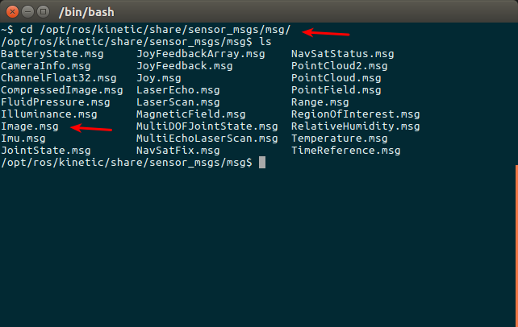
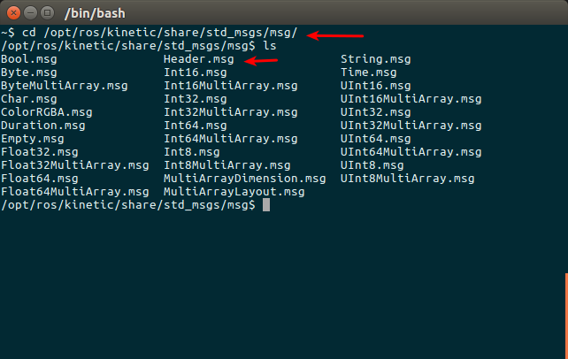

# message消息格式

topic有很严格的格式要求，比如上节的摄像头进程中的rgb图像topic，它就必然要遵循ROS中定义好的rgb图像格式。这种数据格式就是Message。Message按照定义解释就是topic内容的数据类型，也称之为topic的格式标准。这里和我们平常用到的Massage直观概念有所不同，这里的Message不单单指一条发布或者订阅的消息，也指定为topic的格式标准。

## 一、message结构与类型

基本的msg包括bool、int8、int16、int32、int64(以及uint)、float、float64、string、time、duration、header、可变长数组array[] 、固定长度数组array[C]。那么具体的一个msg是怎么组成的呢？我们用一个具体的msg来了解，例如上例中的msg：sensor_msg/image,文件的绝对路径是 **/opt/ros/kinetic/share/sensor_msgs**,它的结构如下：
```python
# This message contains an uncompressed image
# (0, 0) is at top-left corner of image
#

Header header        # Header timestamp should be acquisition time of image
                     # Header frame_id should be optical frame of camera
                     # origin of frame should be optical center of camera
                     # +x should point to the right in the image
                     # +y should point down in the image
                     # +z should point into to plane of the image
                     # If the frame_id here and the frame_id of the CameraInfo
                     # message associated with the image conflict
                     # the behavior is undefined

uint32 height         # image height, that is, number of rows
uint32 width          # image width, that is, number of columns

# The legal values for encoding are in file src/image_encodings.cpp
# If you want to standardize a new string format, join
# ros-users@lists.sourceforge.net and send an email proposing a new encoding.

string encoding       # Encoding of pixels -- channel meaning, ordering, size
                      # taken from the list of strings in include/sensor_msgs/image_encodings.h

uint8 is_bigendian    # is this data bigendian?
uint32 step           # Full row length in bytes
uint8[] data          # actual matrix data, size is (step * rows)
```


可以看到，这里还嵌套了Header结构体：
```python
# Standard metadata for higher-level stamped data types.
# This is generally used to communicate timestamped data 
# in a particular coordinate frame.
# 
# sequence ID: consecutively increasing ID 
uint32 seq
#Two-integer timestamp that is expressed as:
# * stamp.sec: seconds (stamp_secs) since epoch (in Python the variable is called 'secs')
# * stamp.nsec: nanoseconds since stamp_secs (in Python the variable is called 'nsecs')
# time-handling sugar is provided by the client library
time stamp
#Frame this data is associated with
# 0: no frame
# 1: global frame
string frame_id
```


观察上面msg的定义，是不是很类似C语言中的结构体呢？通过具体的定义图像的宽度，高度等等来规范图像的格式。所以这就解释了Message不仅仅是我们平时理解的一条一条的消息，而且更是ROS中topic的格式规范。或者可以理解msg是一个“类”，那么我们每次发布的内容可以理解为“对象”，这么对比来理解可能更加容易。 我们实际通常不会把Message概念分的那么清，通常说Message既指的是类，也是指它的对象。而msg文件则相当于类的定义了。

## 二、msg操作命令

rosmsg的命令相比topic就比较少了，只有两个如下：

rosmsg命令	|作用
:---:|:---:
rosmsg list|	列出系统上所有的msg
rosmsg show msg_name|	显示某个msg的内容

## 三、常见msg消息格式

常见的message类型，包括std_msgs, sensor_msgs, nav_msgs, geometry_msgs等

 1. **Vector3.msg**  

 文件位置:geometry_msgs/Vector3.msg
 ```
 float64 x
 float64 y
 float64 z
 ```

 2. **Accel.msg**  

 定义加速度项，包括线性加速度和角加速度  
 文件位置:geometry_msgs/Accel.msg
 ```
 Vector3 linear
 Vector3 angular
 ```

 3. **Header.msg**

 定义数据的参考时间和参考坐标  
 文件位置:std_msgs/Header.msg
 ```
 uint32 seq      #数据ID
 time stamp      #数据时间戳
 string frame_id #数据的参考坐标系
 ```

 4. **Echos.msg**  

 定义超声传感器  
 文件位置:自定义msg文件
 ```
 Header header
 uint16 front_left
 uint16 front_center
 uint16 front_right
 uint16 rear_left
 uint16 rear_center
 uint16 rear_right
 ```

 5. **Quaternion.msg**

 消息代表空间中旋转的四元数  
 文件位置:geometry_msgs/Quaternion.msg
 ```
 float64 x
 float64 y
 float64 z
 float64 w
 ```

 6. **Imu.msg**

 消息包含了从惯性原件中得到的数据，加速度为m/^2，角速度为rad/s  
 如果所有的测量协方差已知，则需要全部填充进来  
 如果只知道方差，则只填充协方差矩阵的对角数据即可  
 文件位置：sensor_msgs/Imu.msg
 ```
 Header header
 Quaternion orientation
 float64[9] orientation_covariance
 Vector3 angular_velocity
 float64[9] angular_velocity_covariance
 Vector3 linear_acceleration
 float64[] linear_acceleration_covariance
 ```

 7. **LaserScan.msg**

 平面内的激光测距扫描数据  
 注意此消息类型仅仅适配激光测距设备,如果有其他类型的测距设备(如声呐)，需要另外创建不同类型的消息  
 文件位置：sensor_msgs/LaserScan.msg
 ```
 Header header            #时间戳为接收到第一束激光的时间
 float32 angle_min        #扫描开始时的角度(单位为rad)
 float32 angle_max        #扫描结束时的角度(单位为rad)
 float32 angle_increment    #两次测量之间的角度增量(单位为rad)
 float32 time_increment    #两次测量之间的时间增量(单位为s)
 float32 scan_time        #两次扫描之间的时间间隔(单位为s)
 float32 range_min        #距离最小值(m)
 float32 range_max        #距离最大值(m)
 float32[] ranges        #测距数据(m,如果数据不在最小数据和最大数据之间，则抛弃)
 float32[] intensities    #强度，具体单位由测量设备确定，如果仪器没有强度测量，则数组为空即可
 ```

 8. **Point.msg**

 空间中的点的位置  
 文件位置:geometry_msgs/Point.msg
 ```
 float64 x
 float64 y
 float64 z
 ```

 9. **Pose.msg**

 消息定义自由空间中的位姿信息，包括位置和指向信息  
 文件位置:geometry_msgs/Pose.msg
 ```
 Point position
 Quaternion orientation
 ```

 10. **PoseStamped.msg**

 定义有时空基准的位姿  
 文件位置：geometry_msgs/PoseStamped.msg
 ```
 Header header
 Pose pose
 ```

 11. **PoseWithCovariance.msg**

 表示空间中含有不确定性的位姿信息  
 文件位置：geometry_msgs/PoseWithCovariance.msg
 ```
 Pose pose
 float64[36] covariance
 ```
 12. **Power.msg**

 表示电源状态，是否开启  
 文件位置：自定义msg文件
 ```
 Header header
 bool power
 ######################
 bool ON  = 1
 bool OFF = 0
 ```

 13. **Twist.msg**

 定义空间中物体运动的线速度和角速度  
 文件位置：geometry_msgs/Twist.msg
 ```
 Vector3 linear
 Vector3 angular
 ```

 14. **TwistWithCovariance.msg**

 消息定义了包含不确定性的速度量，协方差矩阵按行分别表示：  
 沿x方向速度的不确定性，沿y方向速度的不确定性，沿z方向速度的不确定性  
 绕x转动角速度的不确定性，绕y轴转动的角速度的不确定性，绕z轴转动的角速度的不确定性  
 文件位置：geometry_msgs/TwistWithCovariance.msg
 ```
 Twist twist
 float64[36] covariance  #分别表示[x; y; z; Rx; Ry; Rz]
 ```

 15. **Odometry.msg**

 消息描述了自由空间中位置和速度的估计值  
 文件位置：nav_msgs/Odometry.msg
 ```
 Header header
 string child_frame_id
 PoseWithCovariance pose
 TwistWithCovariance twist
 ```