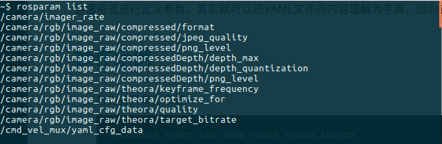
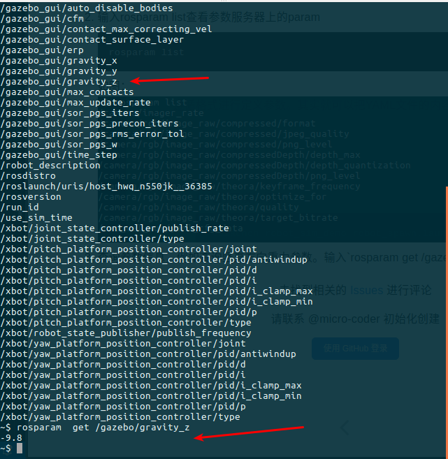
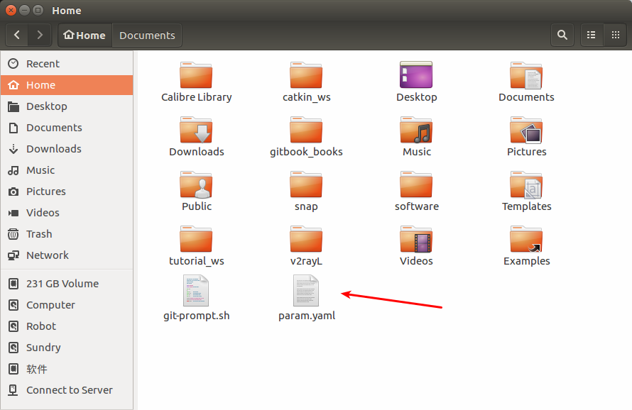

# Parameter Server   参数服务器

## 简介

严格来说，param并不能称作一种通信方式，因为它往往只是用来存储一些静态的设置，而不是动态变化的。所以关于param的操作非常轻巧，非常简单。

前文介绍了ROS中常见的两种通信方式——主题和服务，这节介绍另外一种通信方式——参数服务器（parameter server）。与前两种通信方式不同，参数服务器也可以说是特殊的“通信方式”。特殊点在于参数服务器是节点存储参数、配置参数以及全局共享参数的地方。参数服务器使用互联网传输，在节点管理器中运行，实现整个通信过程。

参数服务器，作为ROS中另外一种数据传输方式，有别于topic和service，它更加的静态。参数服务器维护着一个数据字典，字典里存储着各种参数和配置。

### 字典简介

字典，其实就是一个个的键值对(key:value)。与C++中的`map`,或者python中的`dict`相似。我们小时候学习语文的时候，常常都会有一本字典，当遇到不认识的字，我们可以通过查拼音找到这个字，获取这个字的读音、意义等等。这里的字典可以对比理解记忆。

每一个key不重复，且每一个key对应着一个value。也可以说字典就是一种映射关系，在实际的项目应用中，因为字典的这种静态的映射特点，我们往往将一些不常用到的参数和配置放入参数服务器的字典里，这样对这些数据进行读写都更加方便高效。

## 维护方式

参数服务器的维护方式非常的简单灵活，总的来讲有三种方式：
 * 命令行维护
 * launch文件内读写
 * node源码

下面一一介绍这三种维护方式。

### 命令行维护

使用命令行来维护参数服务器，主要使用rosparam语句来进行操作的各种命令，如下表：

rosparam 命令	|作用
:---:|:---:
rosparam set param_key param_value	|设置参数
rosparam get param_key	|显示参数
rosparam load file_name	|从文件加载参数
rosparam dump file_name	|保存参数到文件
rosparam delete	|删除参数
rosparam list	|列出参数名称

### load&&dump文件
load和dump文件需要遵守YAML格式，YAML格式具体示例如下：
```yaml
name:'Zhangsan'
age:20
gender:'M'
score{Chinese:80,Math:90}
score_history:[85,82,88,90]
```
简明解释,就是 “`名称`+`：`+`值`” 这样一种常用的解释方式。

一般格式：  
key : value

遵循格式进行定义参数。其实就可以把YAML文件的内容理解为字典，因为它也是键值对的形式。

## 操作示例

1. 首先打开模拟场景
```
roslaunch robot_sim_demo robot_spawn.launch
```
2. 输入rosparam list查看参数服务器上的param
```
rosparam list
```
如图：  

3. 查询参数信息，例如查询竖直方向重力参数。输入`rosparam get /gazebo/gravity_z`回车得到参数值
```
rosparam  get /gazebo/gravity_z
```
如图：  

4. 尝试保存一个参数到文件。输入`rosparam dump param.yaml` 之后，就可以在当前路径看到该文件，也就能打开去查看到相关的参数信息
```
rosparam dump param.yaml
```
如图：  
