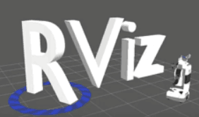

# RViz

RViz(the Robit Visualization tool)机器人可视化工具。  
可视化的作用是直观的显示出图像、雷达等信息，它极大的方便了监控和调试等操作。

Gazebo是一个机器人仿真工具，模拟器，也是一个独立的开源机器人仿真平台。当今市面上还有其他的仿真工具例如V—Rep、Webots等等。但是Gazebo不仅开源，也是兼容ROS最好的仿真工具。



Gazebo的功能很强大，最大的优点是对ROS的支持很好，因为Gazebo和ROS都由OSRF（Open Source Robotics Foundation）开源机器人组织来维护。Gazebo支持很多开源的物理引擎，比如最典型的ODE。可以进行机器人的运动学、动力学仿真，能够模拟机器人常用的传感器（如激光雷达、摄像头、IMU等），也可以加载自定义的环境和场景。

## 操作说明

1. 和我们前面的实例测试一样，我们打开教材的模拟场景
  ```
  roslaunch robot_sim_demo robot_spawn_launch
  ```
2. 打开一个新的终端，并输入`rviz`,就可以打开RViz工具了
  ```
  rviz
  ```
3. 对地图的操作方式：
  * 平移：鼠标滚轮中键
  * 旋转：鼠标左键
  * 放缩：鼠标滚轮
  * 界面左侧是控制面板，可以添加插件
  
RViz的插件种类繁多功能强大，非常适合我们开发调试ROS程序。

## gazebo与RViz

虽然从界面上来看，RViz和Gazebo非常相似，但实际上两者有着很大的不同。Gazebo实现的是仿真，提供一个虚拟的世界；<font color="red">RViz实现的是可视化，呈现接收到的信息，左侧的插件相当于是一个个的subscriber。RViz接收信息，并且显示。</font>所以RViz和Gazebo有本质的差异。